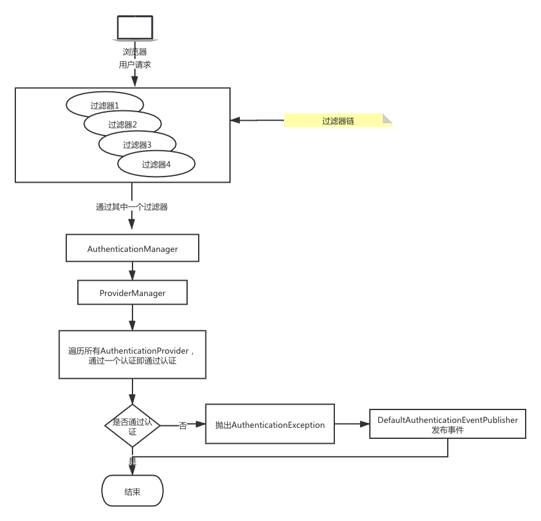
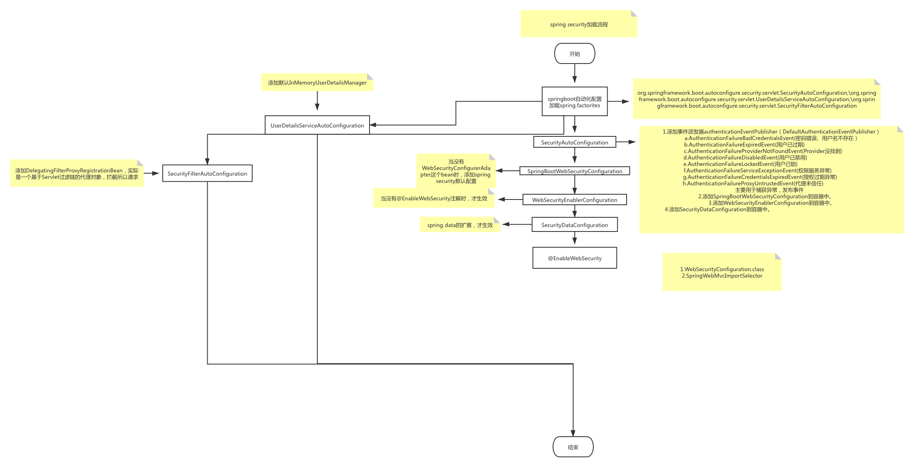

# spring security 实战

## 前言
 spring security是一个强大且高度可定制的安全框架，致力于为Java应用提供身份认证和授权。分别涵盖了三个框架，spring security，spring social，spring oauth。

## 适应人群
 本教程适应与有一定Java基础，学过spring以及springboot的同志。

## 技术要点
- springboot2.3.2
- jdk1.8
- maven

## 基本原理
spring security采用的是责任链的设计模式。

## 默认配置加载过程流程图

